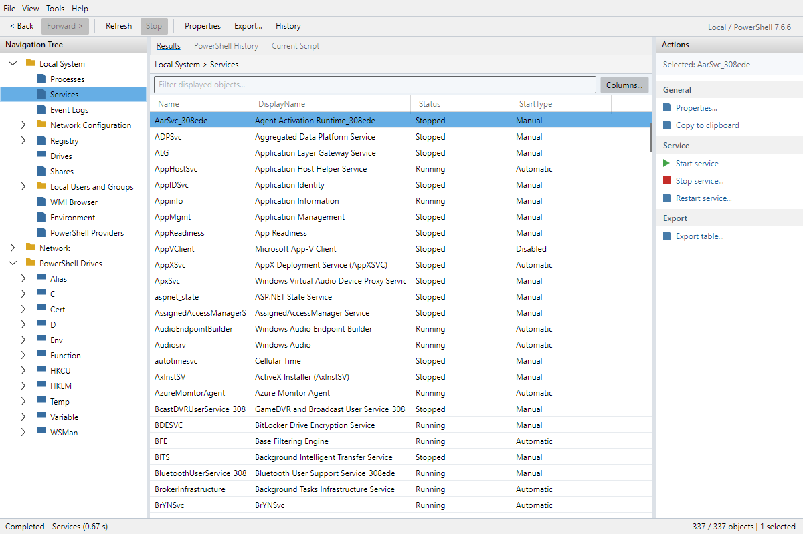

# Runspace

Runspace is a desktop administration console inspired by PowerGUI. Browse resources, inspect PowerShell objects, and run contextual actions without assembling one-off commands.

Built with **.NET 10**, **PowerShell 7**, and **Avalonia** for Windows, macOS, and Linux. The current application uses built-in views; Windows-specific resources require Windows and the appropriate modules and permissions.



## What you can do

- Browse processes, provider drives, environment entries, and local network information.
- Manage Windows services and inspect event logs, registry keys, shares, local accounts, and CIM objects.
- Filter and sort typed tables, inspect properties, follow related views, and export visible rows as CSV.
- Run selection-aware actions with confirmation where appropriate, then inspect PowerShell history and diagnostics.

Operations run with your current account's permissions. Missing capabilities and failures are shown explicitly.

## Quick start

Download a self-contained package from [GitHub Releases](https://github.com/adamdriscoll/runspace/releases): ZIPs for Windows x64, Linux x64, and macOS ARM64, plus a Windows MSI and macOS DMG. Packages are currently unsigned; see the [installation and launch instructions](docs/usage.md#launching-runspace) for platform requirements and OS security prompts.

To run from source:

Install the **.NET 10 SDK** matching `global.json` (10.0.401, with patch roll-forward). A separate PowerShell installation is not required for the embedded engine.

From the repository root in PowerShell:

```powershell
dotnet restore Runspace.slnx --locked-mode
dotnet build Runspace.slnx
dotnet run --project .\src\Runspace.Desktop\Runspace.Desktop.csproj
```

For published executables, macOS/Linux launch commands, native dependencies, and the verified platform matrix, see the [usage guide](docs/usage.md#launching-runspace). Published outputs embed .NET and PowerShell; require a passing **Published payload** CI job rather than treating compilation as deployment validation.

## Documentation

| Guide | Contents |
| --- | --- |
| [Usage](docs/usage.md) | Built-in views, table controls, actions, cancellation, and saved settings |
| [Contributing](CONTRIBUTING.md) | Development setup, tests, publishing, and pull requests |
| [Implementation notes](docs/foundation.md) | Current project structure and technical constraints |
| [Domain glossary](CONTEXT.md) | Resource, object, session, and action terminology |

Planned work and acceptance gates live in [GitHub issues](https://github.com/adamdriscoll/runspace/issues/24), not a separate Markdown roadmap.
