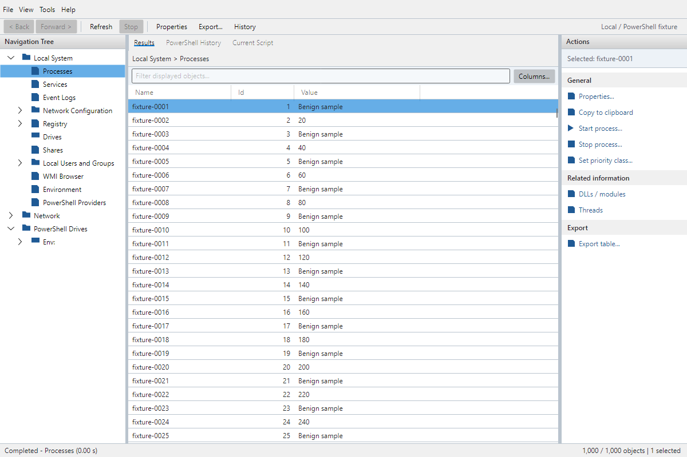

# Compact shell acceptance record

Recorded 2026-10-06 for [issue #2](https://github.com/adamdriscoll/runspace/issues/2). This is validation and gap-closing of the existing shell, not a replacement shell or a PowerGUI parity claim.

**The automated fixture gate passes; native-monitor and assistive-technology acceptance is still open.** The images below are actual Avalonia/Skia offscreen client-area renders with headless render scaling, not resized images or screenshots of a physical monitor. They do not establish native window-manager DPI behavior, multi-monitor transitions, or what a screen reader announces.

## Fixture and measured layout

`ConsoleTests` uses `IConsoleSession`, never production resources. The dense fixture contains 1,000 original rows with fixed handles, numeric IDs, and alternating numeric/string values. No fixture script is executed. It disables saved-layout persistence, starts in Processes, selects the first row, and leaves Diagnostics collapsed. Existing fixture sessions also cover empty/partial/failing results, prompts, cancellation, and related views.

The test sets and asserts **client size in DIP** and `RenderScaling`, captures a frame, verifies its physical pixel dimensions, and then measures complete rows contained within both the rows presenter and grid. It checks command text/control bounds and asserts fewer than 61 realized rows. Scrolling to row 1,000 must realize that row without another query.

| Client size (DIP) | Scale | Raster size (pixels) | Complete rows, Windows / Linux | Realized rows | Windows fixture capture |
| --- | --- | --- | --- | --- | --- |
| 1000 x 680 | 100% | 1000 x 680 | 21 / 21 | 22 | [PNG](images/shell-validation/console-1000x680-100.png), [measurements](images/shell-validation/console-1000x680-100.json) |
| 1000 x 680 | 150% | 1500 x 1020 | 20 / 20 | 22 | [PNG](images/shell-validation/console-1000x680-150.png), [measurements](images/shell-validation/console-1000x680-150.json) |
| 1000 x 680 | 200% | 2000 x 1360 | 21 / 21 | 22 | [PNG](images/shell-validation/console-1000x680-200.png), [measurements](images/shell-validation/console-1000x680-200.json) |
| 1200 x 800 | 100% | 1200 x 800 | 26 / 26 | 27 | [PNG](images/shell-validation/console-1200x800-100.png), [measurements](images/shell-validation/console-1200x800-100.json) |
| 1200 x 800 | 150% | 1800 x 1200 | 25 / 25 | 27 | [PNG](images/shell-validation/console-1200x800-150.png), [measurements](images/shell-validation/console-1200x800-150.json) |
| 1200 x 800 | 200% | 2400 x 1600 | 26 / 26 | 27 | [PNG](images/shell-validation/console-1200x800-200.png), [measurements](images/shell-validation/console-1200x800-200.json) |

Rounding at fractional scaling accounts for the one-row difference. Both tested sizes exceed the required 20-row gate, including 1200 x 800 at 100%. Grid content and navigation may scroll; a partially visible next row is not counted as complete.



Additional captures show [high contrast at 150%](images/shell-validation/high-contrast-1000x680-150.png) and [200%](images/shell-validation/high-contrast-1000x680-200.png), both at 1000 x 680 DIP. The long, scrollable 12-field host prompt is 520 x 640 DIP: [150%](images/shell-validation/prompt-150.png), [200%](images/shell-validation/prompt-200.png). The prompt captures intentionally show the scrolled lower fields and reachable buttons, not all fields at once. Labels wrap, keyboard focus brings editors/buttons into view, and Escape dismisses the prompt.

## Interaction and accessibility coverage

| Surface | Fixture-backed checks and gap closure |
| --- | --- |
| Compact chrome | Menu/toolbar/filter rows measure their contents instead of clipping to fixed heights. Toolbar commands can wrap. Side panes have minimum widths; action labels wrap at the 180-DIP minimum. Navigation has horizontal scrolling for long labels. |
| Keyboard result routes | Raw key-down/up input exercises Enter -> Properties, Enter -> related view, Alt+Left -> source, Ctrl+A, Ctrl+F, F5, menu key, and Shift+F10. Shell shortcuts tunnel before DataGrid's handlers; opening the context menu waits until key-up so the opening gesture cannot immediately dismiss it. |
| Context menus | Zero/one/multiple selections produce identical pane/menu action IDs and enabled state. Arrow keys and Enter invoke Properties from the menu. Right-click on a selected row preserves multi-selection; right-click on another row selects it before resolving actions. |
| Columns and splitters | Keyboard input opens Columns, selects a column, moves it, edits width, sorts numeric IDs, hides it, and restores default visibility/order/width. Hiding the final visible column is rejected with a message. Focusable, named splitters resize with arrows and stop at 160/180-DIP minima. |
| Reset layout | Alt+V then L invokes View -> Reset layout, restoring pane widths/star sizing and hiding Diagnostics. Its access key no longer collides with Refresh. This is a headless Windows/Linux route, not a verified macOS menu convention. |
| Selection and filtering | Numeric/string cached values and related/non-related rows coexist. Mixed selection disables the single-row related action. Filtering clears only hidden selected rows and reports the removed selection; visible selected rows remain selected. Selection, filtering, sorting, and scrolling do not call fixture execution. |
| Names and state | Automation peers expose names for the tree, result table/rows, filter, paths, history/script/diagnostics, splitters, property table/value, parameter/host editors, and column controls. Tests assert command enabled state/help and row Selected/Not selected item status. Status/selection messages are polite live regions; validation errors are assertive. These peer assertions do not prove delivery through a native accessibility bridge. |
| Focus and outcomes | Keyboard-visible focus is asserted on buttons/splitters. Properties focuses its table; prompts focus an editor; column controls focus their selector. A partial-error refresh reveals Diagnostics without stealing filter focus. CompletedWithErrors/error text, selected counts, and cancellation/pending states are textual, not color-only indicators. |
| Contrast and prompts | View -> High contrast supplies black/white shell chrome and yellow accents with a dark Fluent control fallback. Owned dialogs inherit the selected variant. Long host prompts, choice/credential/secure editors, required-field validation, and Escape cancellation remain usable; secrets are masked and cleared by the existing prompt tests. Contrast is an explicit session-local choice, not automatic OS-palette detection. |

The built-in eligibility contract is resource/cardinality based, using cached row metadata, not arbitrary runtime type/getter evaluation during selection. The mixed fixture does not claim support for third-party action definitions or automatic runtime-type eligibility. The execution adapter still validates original handles and rejects incompatible action targets.

## Supported table adapter decision

Retain **Avalonia.Controls.DataGrid 12.1.2**, pinned in the existing manifests/locks. Its package declares **MIT** in `avalonia.controls.datagrid.nuspec`. Deprecation is a maintenance risk, not a reason to silently lose existing behavior. This gate demonstrates virtualized rows, read-only extended selection, movable/resizable/show-hide columns, typed custom sorting, cached-value filtering, and shared pane/menu eligibility.

The existing [foundation evaluation](foundation.md#project-layout) found that core TableView would require additional work for the complete moving/sorting/selection contract. No replacement is adopted here and no commercial TreeDataGrid dependency or implied license entitlement is introduced. Any replacement must pass these fixture checks and preserve cached cells/live-handle ownership, keyboard controls, selection reconciliation, and accessible names/state under suitable licensing.

The current DataGrid row peer exposes **item-status text** for selection. This is not a claim that the adapter supplies every native selection/table automation pattern; native screen-reader qualification must evaluate that limitation before the full accessibility gate is closed.

## Reproduction and platform limits

Windows 11 build 26200, .NET SDK 10.0.401/runtime 10.0.12: the solution suite passed **59 core/runtime + 71 desktop tests** in Debug and Release. Linux used an isolated copy in `mcr.microsoft.com/dotnet/sdk:10.0.401`, with `libfontconfig1` and `fonts-dejavu-core`, and passed the same counts in Release. Linux captures/measurements were also inspected; the repository images are from Windows Release. Windows-only runtime branches are not exercised by the Linux count.

To regenerate evidence on Windows from the repository root:

```powershell
$env:RUNSPACE_UI_CAPTURE_DIR = Join-Path $PWD 'artifacts\fixture-ui'
dotnet test .\tests\Runspace.Desktop.Tests\Runspace.Desktop.Tests.csproj `
  --filter 'FullyQualifiedName~CompactClientSizes|FullyQualifiedName~HighContrast'
```

Leaving the variable unset still verifies rendering and dimensions without writing files. CI runs the complete suite on its Windows/Linux/macOS matrix and uploads `fixture-ui-<rid>` artifacts. Workflow configuration is not evidence that the new macOS gate has already passed.

Still required before closing the full acceptance gate: native Windows 11, Ubuntu 24.04 X11/XWayland, and macOS 15 ARM64 keyboard walkthroughs at real 150%/200% settings (or the platform's equivalent backing scale), including menu conventions, focus return, OS contrast settings, native prompts/window bounds, and multi-monitor changes. Exercise Narrator, Orca, and VoiceOver for names, selected/expanded/disabled state, live-region delivery, and the DataGrid automation-pattern limitation. No such native reader or macOS run is claimed by this record.

## Intentional reference deviations

PowerGUI is inspiration only. These captures use original fixture data and original geometric icons; no historical artwork, logos, scripts, or binaries are distributed. The prior [reference observation](foundation.md#actual-powergui-reference-run) motivates gray pane captions and a dense tree/table/grouped-action layout, not pixel-identical styling.

The Actions pane remains visible for discoverability. Properties, explicit partial/error banners, the provider-path editor, textual outcomes, high contrast, and keyboard column controls are deliberate modern affordances. Splitters/tabs replace floating docking; there is no chart/report designer or legacy Hyper-V surface. Full per-view column/filter persistence and comfortable density remain outside this implemented foundation.
